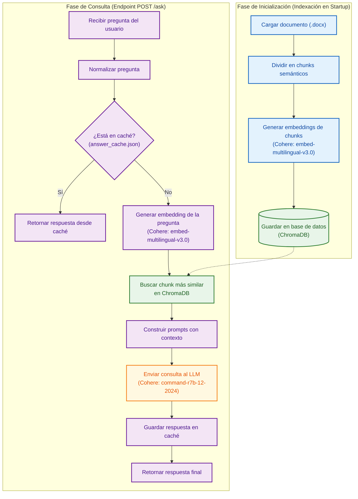

# 📄 RAG Document Assistant

<div align="center">


</div>

## 📢 Descripción general

API desarrollada con **FastAPI** que implementa una solución simple de **RAG (Retrieval-Augmented Generation)** para responder preguntas sobre un documento local usando embeddings, búsqueda vectorial y un LLM.

---

## 🚀 Objetivo

El objetivo del proyecto es permitir que un usuario realice preguntas sobre un documento y obtenga una respuesta generada por un LLM, basada únicamente en el contexto más relevante recuperado desde una base vectorial.

---

## 🧠 ¿Cómo funciona?

El flujo principal es:

1. Se carga el documento ubicado en `app/data/documento.docx`.
2. El texto se divide en chunks semánticos.
3. Cada chunk se convierte en un embedding usando Cohere.
4. Los chunks y sus embeddings se almacenan en ChromaDB.
5. Cuando llega una pregunta, también se genera su embedding.
6. ChromaDB busca el chunk más similar a la pregunta.
7. El contexto recuperado se envía al LLM junto con la pregunta.
8. El LLM genera una respuesta siguiendo las reglas definidas en el prompt.

### Diagrama de flujo del sistema



---

## 🧩 Tecnologías utilizadas

* Python
* FastAPI
* Uvicorn
* Cohere
* ChromaDB
* Python Docx
* Docker
* Postman

---

## 📁 Estructura del proyecto

```text
rag-document-assistant/
│
├── app/
│   ├── main.py
│   ├── services/
│   │   ├── document_loader.py
│   │   ├── vector_store.py
│   │   └── rag_service.py
│   ├── prompts/
│   │   └── prompt.py
│   └── data/
│       └── documento.docx
│
├── requirements.txt
├── .env.example
├── README.md
├── Dockerfile
├── .dockerignore
└── postman_collection.json
```

---

## ✂️ Estrategia de chunks

El documento fue dividido en **5 chunks**, porque contiene 5 secciones temáticas independientes:

* Ficción Espacial
* Ficción Tecnológica
* Naturaleza Deslumbrante
* Cuento Corto
* Características del Héroe Olvidado

Cada sección tiene información autocontenida, por lo que un chunk por sección permite una recuperación simple, clara y precisa.

Si el documento fuera más extenso, se podría aplicar una estrategia automática de chunking por párrafos, con tamaño máximo y solapamiento entre fragmentos.

---

## 🔎 Búsqueda del contexto relevante

Para recuperar el contexto más relevante:

1. Cada chunk del documento se convierte en un embedding.
2. La pregunta del usuario también se convierte en un embedding.
3. ChromaDB compara el embedding de la pregunta contra los embeddings guardados.
4. Se devuelve el chunk con mayor similitud semántica.

Esto permite encontrar información relevante aunque la pregunta no use exactamente las mismas palabras que el documento.

---

## 🤖 Modelos utilizados

Se utiliza Cohere para dos tareas:

* `embed-multilingual-v3.0`: generación de embeddings.
* `command-r7b-12-2024`: generación de respuestas.

Se eligió un modelo de embeddings multilingüe porque las preguntas pueden realizarse en español, inglés o portugués.

---

## 🧾 Reglas de respuesta

El prompt está diseñado para que la respuesta cumpla con estas reglas:

* Responder usando solo el contexto recuperado.
* Responder en una sola oración.
* Responder en el mismo idioma que la pregunta.
* Responder siempre en tercera persona.
* Agregar emojis relevantes al final.
* Mantener una respuesta determinística ante la misma pregunta.

Además, se utiliza `temperature=0` y una cache persistente para asegurar que la misma pregunta sobre el mismo contexto devuelva exactamente la misma respuesta.

---

## ⚙️ Configuración local

Clonar el repositorio y acceder al directorio:

```bash
git clone https://github.com/virginia-carrizo-bello/rag-document-assistant.git
cd rag-document-assistant
```

Crear un ambiente virtual:

```bash
python -m venv .venv
```

Activarlo en Windows PowerShell:

```bash
.venv\Scripts\Activate.ps1
```

Instalar dependencias:

```bash
pip install -r requirements.txt
```

Crear un archivo `.env` basado en `.env.example`:

```env
COHERE_API_KEY=your_cohere_api_key_here
```

---

## ▶️ Ejecutar la API localmente

```bash
uvicorn app.main:app --reload
```

Luego abrir:

```text
http://127.0.0.1:8000/docs
```

---

## 📬 Endpoint principal

### POST `/ask`

Request:

```json
{
  "user_name": "John Doe",
  "question": "What did Emma decide to do?"
}
```

Response:

```json
{
  "user_name": "John Doe",
  "question": "What did Emma decide to do?",
  "answer": "Emma decided to share her extra day with the village, leaving an unforgettable mark on every inhabitant's heart 🎁🏘️."
}
```

---

## 🧪 Preguntas de prueba

```text
Quien es Zara?
What did Emma decide to do?
What is the name of the magical flower?
Qual é o nome da flor mágica?
```

---

## 🐳 Ejecutar con Docker

Construir la imagen:

```bash
docker build -t rag-document-assistant .
```

Ejecutar el contenedor:

```bash
docker run --env-file .env -p 8000:8000 rag-document-assistant
```

Luego abrir:

```text
http://127.0.0.1:8000/docs
```

---

## 📮 Postman

El proyecto incluye una colección de Postman:

```text
postman_collection.json
```

Esta colección permite probar el endpoint `POST /ask` de forma simple.

---
## Autora

Virginia Carrizo Bello - AI Engineer / Agentic AI

virginia.carrizo.bello@gmail.com